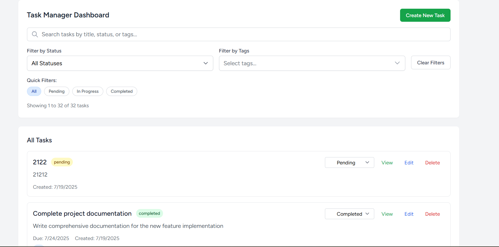
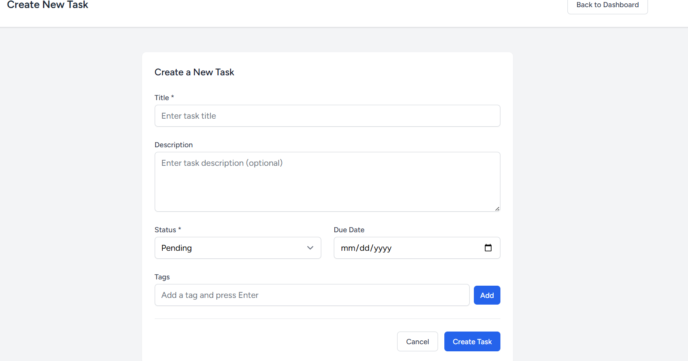
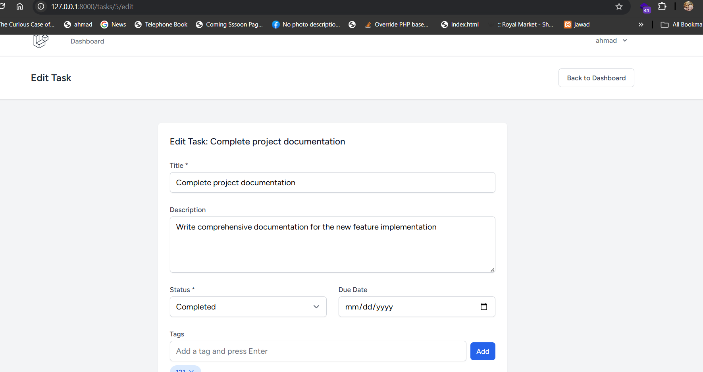
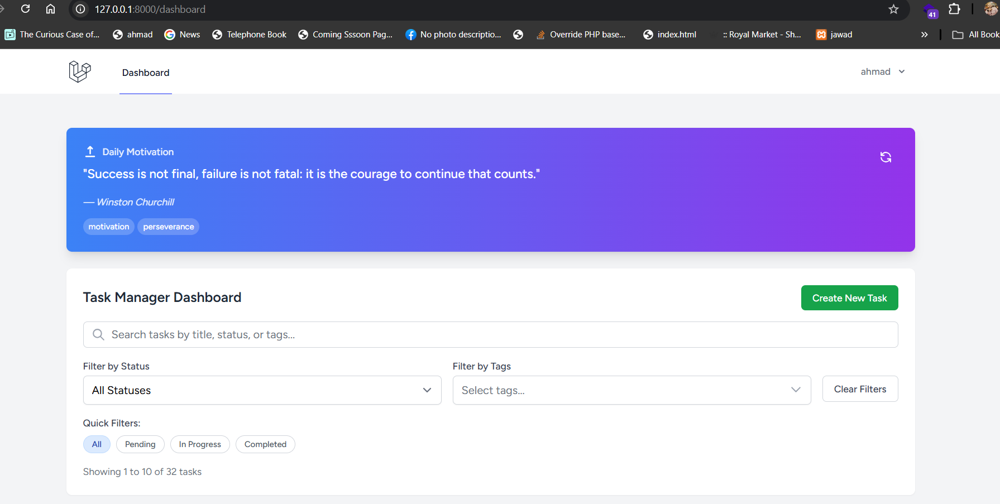

# Task Manager - Laravel + Vue.js Application

A modern, full-featured task management application built with Laravel 12, Vue.js 3, and Inertia.js. This application provides a beautiful, responsive interface for managing tasks with features like search, filtering, tags, and motivational quotes.

## 🛠️ Technology Stack

### Backend
- **Laravel 12**: PHP framework
- **MySQL/SQLite**: Database
- **Inertia.js**: Server-side rendering
- **Laravel Breeze**: Authentication scaffolding
- **Laravel Sanctum**: API authentication

### Frontend
- **Vue.js 3**: Progressive JavaScript framework
- **Inertia.js**: Client-side routing
- **Tailwind CSS**: Utility-first CSS framework
- **Vite**: Build tool and development server

### External APIs
- **Quotable.io**: Motivational quotes API

## 📋 Prerequisites

Before you begin, ensure you have the following installed:
- **PHP 8.2+**
- **Composer**
- **Node.js 18+**
- **npm** or **yarn**
- **MySQL** or **SQLite**

## 🚀 Installation & Setup

### 1. Clone the Repository
```bash
git clone <https://github.com/ahmadAlhussni97/task-manager.git>
cd task-manager
```

### 2. Install PHP Dependencies
```bash
composer install
```

### 3. Install Node.js Dependencies
```bash
npm install
```

### 4. Environment Configuration
```bash
# Copy environment file
cp .env.example .env

# Generate application key
php artisan key:generate
```

### 5. Database Setup
```bash
# Configure your database in .env file
# Run migrations
php artisan migrate

# Seed the database with sample data
php artisan db:seed


### 6. Build Assets
```bash
# For development
npm run dev

# For production
npm run build

## 🏃‍♂️ Running the Application

### Development Mode
```bash
# Terminal 1: Start Laravel development server
php artisan serve

# Terminal 2: Start Vite development server (if not using --host)
npm run dev


## 📱 Application Screenshots

### Dashboard

*Main dashboard showing tasks, search filters, and motivational quote*

### Task Creation

*Form for creating new tasks with title, description, status, due date, and tags*

### Task Editing

*Edit existing tasks with all fields and status updates*

### Motivational Quote

*Daily motivational quote with refresh button and tag display*


## 📁 Project Structure
task-manager/
├── app/
│   ├── Http/Controllers/            # Application controllers
│   │   ├── Api/                     # API controllers
│   │   ├── Auth/                    # Authentication controllers
│   │   ├── DashboardController.php  # Dashboard logic
│   │   └── TaskController.php       # Task CRUD operations
│   ├── Models/                      # Eloquent models
│   │   ├── Task.php                 # Task model with scopes
│   │   └── User.php                 # User model
│   └── Services/                    # Business logic services
│       └── QuoteService.php         # Quote API integration
├── database/
│   ├── migrations/                  # Database migrations
│   ├── seeders/                     # Database seeders
│   └── factories/                   # Model factories
├── resources/
│   └── js/
│       ├── Components/              # Reusable Vue components
│       ├── Layouts/                 # Page layouts
│       ├── Pages/                   # Inertia page components
│       │   ├── Auth/                # Authentication pages
│       │   ├── Dashboard.vue        # Main dashboard
│       │   ├── Tasks/               # Task management pages
│       │   └── Quote/               # Quote display
│       └── app.js                   # Application entry point
├── routes/
│   ├── web.php                      # Web routes
│   └── api.php                      # API routes
└── tests/                           # Application tests
```


## 🧪 Testing

```bash
# Run all tests
php artisan test

# Page For test external api ( motivational quote )
url: http://127.0.0.1:8000/api-test


### Environment Variables
```env
APP_NAME=task-manager
APP_ENV=local
APP_KEY=
APP_DEBUG=true
APP_URL=http://localhost

APP_LOCALE=en
APP_FALLBACK_LOCALE=en
APP_FAKER_LOCALE=en_US

APP_MAINTENANCE_DRIVER=file
# APP_MAINTENANCE_STORE=database

PHP_CLI_SERVER_WORKERS=4

BCRYPT_ROUNDS=12

LOG_CHANNEL=stack
LOG_STACK=single
LOG_DEPRECATIONS_CHANNEL=null
LOG_LEVEL=debug

DB_CONNECTION=mysql
DB_HOST=127.0.0.1
DB_PORT=3306
DB_DATABASE=task-manager
DB_USERNAME=
DB_PASSWORD=


SESSION_DRIVER=database
SESSION_LIFETIME=120
SESSION_ENCRYPT=false
SESSION_PATH=/
SESSION_DOMAIN=null

BROADCAST_CONNECTION=log
FILESYSTEM_DISK=local
QUEUE_CONNECTION=database

CACHE_STORE=database
# CACHE_PREFIX=

MEMCACHED_HOST=127.0.0.1

REDIS_CLIENT=phpredis
REDIS_HOST=127.0.0.1
REDIS_PASSWORD=null
REDIS_PORT=6379

MAIL_MAILER=log
MAIL_SCHEME=null
MAIL_HOST=127.0.0.1
MAIL_PORT=2525
MAIL_USERNAME=null
MAIL_PASSWORD=null
MAIL_FROM_ADDRESS="hello@example.com"
MAIL_FROM_NAME="${APP_NAME}"

AWS_ACCESS_KEY_ID=
AWS_SECRET_ACCESS_KEY=
AWS_DEFAULT_REGION=us-east-1
AWS_BUCKET=
AWS_USE_PATH_STYLE_ENDPOINT=false

VITE_APP_NAME="${APP_NAME}"

**Happy Task Managing! 🎉**
